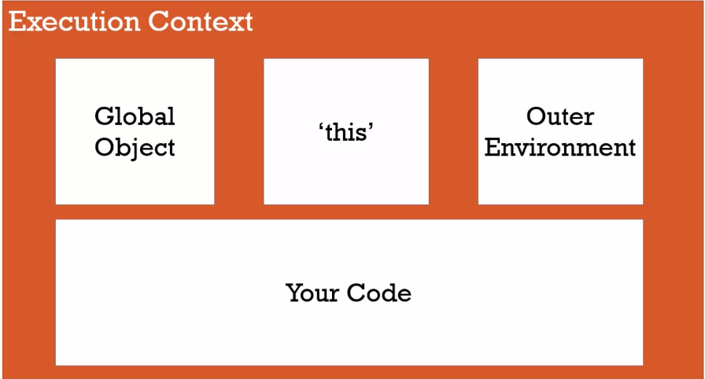

# Javascript Understanding the Weird Parts Notes

## 7. Conceptual Aside: Syntax Parsers, Execution Contexts, Lexical Environments

### 7.1 SYNTAX PARSER
A program that reads your code and determines what it does and if its grammar is valid.

### 7.2 Lexical Environment
Where Something physically in the code you write.
Every Lexical Environment consists of:

Environment Record → Stores all variables and functions declared in the current scope.
Reference to the Outer Lexical Environment → A link to the surrounding (parent) scope.

*Example 1:*

```js
function outer() {
  let a = 10;

  function inner() {
    let b = 20;
    console.log(a); // 10 (accesses 'a' from outer scope)
  }
  inner();
}

outer();
```

**Explanation:**

outer() creates a Lexical Environment that stores a = 10.
Inside outer(), inner() is defined. It remembers the outer environment.

When inner() runs, it:
1 - Looks for a inside its own scope (not found).
2 - Goes to the outer lexical environment (finds a = 10).
JavaScript resolves variables by climbing up the lexical scope chain.


*Example 2: Closures & Lexical Environment*

```js
function counter() {
  let count = 0;

  return function () {
    count++;
    console.log(count);
  };
}

const increment = counter();
increment(); // 1
increment(); // 2
increment(); // 3

```

**How Lexical Environment Works Here:**
counter() runs, creating a Lexical Environment where count = 0.
It returns an inner function that remembers this environment.
Even after counter() finishes, the inner function retains access to count (closure).
Calling increment() modifies the preserved count variable.


### 7.3 Execution Context
A Wrapper to help manage the code that is running.
There are a lot of lexical environments, Which one is currently running is managed via execution contexts. It can contain things beyond what you've written in the code.

## 8. Conceptual Aside: Name/Value Pairs and Objects
A Name which maps to a unique value.
The name may be defined more than once, but only can have one value in any given context. That value may be more name/value pairs.

**Example**
```js
Adress = '100 Main St,'
```
An **Object** is a colection of name/value pairs.


## 10. The Global Environment and The Global Object:
The execution context is created when you run javascript. This can be checked by running `this` on the console. This is the global object inside the browser.

In the case of the browsers is the `window` object.

**GLOBAL** - Not inside a function basically.
**Outter Environment** If you're running code inside a function, it's the code that is in the outside layer.




## 11. The Execution Context - Creation and Hoisting

**Hoisting** 

```js
var a = 'Hello World'

function b() {
  console.log('Called b');
}

b();
console.log(a);

// this will print
// Called b
// Hello world
```

```js
b();
console.log(a)

var a = 'Hello World'

function b() {
  console.log('Called b');
}


// this will print
// Hello world
// undefined

```

Hoisting will see that the variable is declared and create "space" for it, but will not have the declared variables that comes bellow - the `Hello World`.

If we remove the `var a = 'Hello World'` line, it will trigger an uncaught error because the variable is not declared.

### How the execution context is created (CREATION PHASE)


## 12. Conceptual Aside: Javascript and 'undefined'
Undefined is a special value. It's the value that the variables will receive in the creation fase, the first fase of creating an executing context.

## 13. The execution Context - Code Execution

Consider the following code:

```js
function b() {
  console.log('Called b');
}

b();
console.log(a)

var a = 'Hello World';

console.log(a);
```

This will log: 

```
Called b!
undefined
'Hello World'
```

## 14. Conceptual Aside: Single Threaded, Synchronous Execution
Javascript is Single Threaded and Synchronous.

Single Threaded: One command at a time.

Synchronous: One at a Time (and in order).

## 15. Function Invocation and the Execution Stack

Invocation: Running a Function. In javascript it's the `()`.

```js

function b() {

}

function a() {
  b();
}

a();
```
The execution context is created:

After that it sets up the memory for each function and executes line by line.

It will create an execution context for `a()`.
But since we have another function invoked `b()` it will create another execution context for that function.
Everytime a function is invoked it will create a new one.

And when the function b is ran, it's popped off the execution context and will go for the next one, in this case function a.

## 16. Functions, Context and Variable Environments

__Variable Environment__ - Where variables live.

### Code example:

```js
function b() {
  var myVar;
  console.log(myVar);
}

function a() {
  var myVar = 2;
  console.log(myVar);
  b();
}

var myVar = 1;
console.log(myVar);
a();
```

What happens? (each step will override the prior because they are execution fases).

1. Global Execution Context - myVar = 1
2. a() Execution Context - myVar = 2
3. b() Execution Context - myVar = undefined

If we had console logs inside each function you would have a log like this:

```js
1
2
undefined
```

## 17. The Scope Chain
What would this log print? 

```js
function b() {
  console.log(myVar);
}

function a() {
  var myVar = 2;
  b();
}
var myVar = 1;
a();

```

This would log: __1__

Because if the javascript can't find a reference to a variable in the execution context, it will look for the variable inside the outter context (global execution context).


